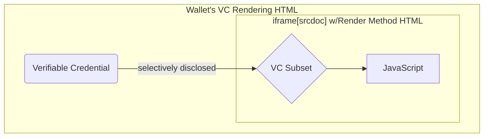

# HTML Render Method testing

The HTML [Render Method](https://w3c.github.io/vc-render-method/) approach uses
a sandboxed environment (typically an
`<iframe>` + [CSP](https://developer.mozilla.org/en-US/docs/Web/HTTP/Reference/Headers/Content-Security-Policy))
to allow JavaScript to be used for rendering (some or all of) a Verifiable
Credential into an HTML page.

This allows developers to provide a JavaScript rendering runtime while
preventing access to the network for that runtime.

## Architecture

